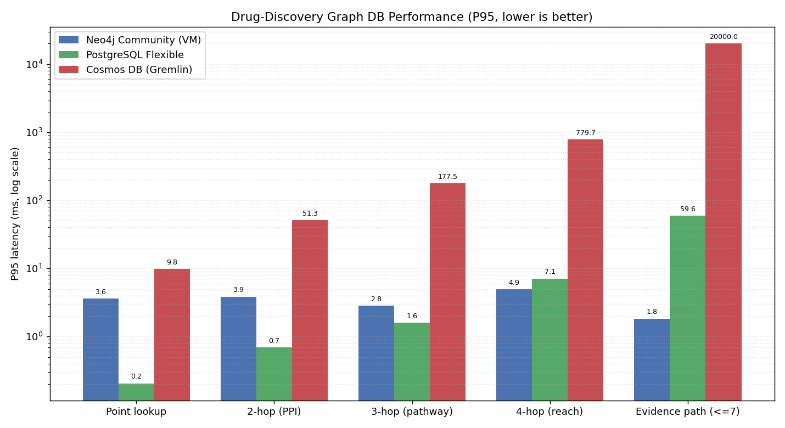

# Neo4j / PostgreSQL / Cosmos DB 图数据库性能对比

## 项目结论

本项目在 Azure 上使用同一份**合成药物研发知识图谱**（异构、Hetionet 风格）数据，对三种图相关存储方案进行了性能对比：

- Neo4j Community Edition，部署在 Azure VM 上
- Azure Database for PostgreSQL Flexible Server
- Azure Cosmos DB Gremlin API

本轮测试专门面向**药物研发分析与知识推理**场景，工作负载以**带语义的多跳通路遍历**（化合物→靶点→通路→疾病，2/3/4 跳）和**最短证据链（化合物↔疾病，最多 7 跳）**为主，而非浅层关联查询。结果显示三类数据库的适用场景差异巨大：

- Neo4j 在多跳通路遍历和最短证据链上全面领先，且延迟随跳数增长最平缓——最短证据链 P50 仅约 1.4 ms
- PostgreSQL 在点查和中低跳计数上极快，但最短证据链（层级同步 BFS）成本明显上升，P50 约 15 ms、P95 约 60 ms
- Cosmos DB Gremlin 在 3/4 跳已显著变慢（4 跳 P50 约 0.6 秒），最短证据链全部触发服务端超时（20/20）而无法返回

补充来看，浅层查询（点查、2 跳计数）上 PostgreSQL 表现最好，Neo4j 也能稳定保持毫秒级，但总体略慢于 PostgreSQL；Cosmos DB Gremlin 的点查尚可，一旦进入 2 跳后延迟就明显上升。

结论：若图数据库主要服务于药物研发分析和知识推理（多跳通路、证据链、靶点发现），**Neo4j 是唯一能在毫秒级稳定完成深度通路遍历与证据链的引擎**；PostgreSQL 适合浅层结构化检索与中低跳计数；Cosmos DB Gremlin 在这类深跳证据链负载下并不适用。

## 配置与测试范围

### Azure 资源配置

| 组件 | 规格 | CPU / 内存 | 其他关键配置 |
|---|---|---:|---|
| Neo4j VM | `Standard_D4s_v5` | 4 vCPU / 16 GiB | Ubuntu 22.04，Premium SSD 数据盘，单机部署 |
| PostgreSQL Flexible Server | `Standard_D4ds_v5` | 4 vCore / 16 GiB | PostgreSQL 16，128 GB 存储，General Purpose，未开启 HA |
| Cosmos DB Gremlin | Gremlin API | 按 RU/s 计费 | 图数据库 `graphdb.social`，分区键 `/pk` |

### 数据规模与测试方式

- 数据规模：约 20,000 个节点，200,000 条边
- 图结构：异构药物研发知识图谱（Hetionet 风格），带 hub 偏斜（少数高连接度的蛋白与疾病枢纽）
  - 节点类型：Compound（化合物，20%）、Protein（蛋白，35%）、Gene（基因，25%）、Disease（疾病，15%）、Pathway（通路，5%）
  - 关系类型：`TARGETS`（化合物→蛋白）、`INTERACTS`（蛋白↔蛋白 PPI）、`ENCODES`（基因→蛋白）、`ASSOCIATED_WITH`（基因→疾病）、`PARTICIPATES_IN`（蛋白→通路）、`IMPLICATED_IN`（通路→疾病）、`TREATS`（化合物→疾病，已知疗法）
- 执行位置：全部从同一台 Azure VM（`centralus`）发起请求，尽量保证网络口径一致
- 测试操作（药物研发推理负载）：
  - **化合物点查**（按 id 取名）
  - **2 跳**：化合物 →靶点→ PPI（`TARGETS`→`INTERACTS`）
  - **3 跳**：化合物 →靶点→通路→疾病（`TARGETS`→`PARTICIPATES_IN`→`IMPLICATED_IN`）
  - **4 跳**：化合物 →靶点→PPI→通路→疾病（再多一层 `INTERACTS`）
  - **最短证据链**：化合物 ↔ 疾病之间最多 7 跳的最短可解释路径
- 计量方式：
  - 点查、2 跳、3 跳：每个操作 200 次正式测量 + warmup
  - 4 跳 / 最短证据链：每个操作 20 次正式测量（深跳代价高，缩短迭代以控制总时长）
- Cosmos DB 专项处理：深跳遍历在 hub 偏斜图上会组合爆炸，因此为 Cosmos 的深跳操作设置**单查询超时**（4 跳 20 秒、最短证据链 20 秒）。**超时的查询按超时值计为惩罚延迟**，并单独统计 `timeouts` 次数，以保证测试始终可产出结果并如实反映其深跳劣势。本轮加载阶段曾临时将 Cosmos 图吞吐提升到 40,000 RU/s 以避免限流；即便如此，最短证据链仍 20/20 全部超时。此外，批量加载时 gremlinpython 会逐条打印 429（`RequestRateTooLarge`）诊断日志，已在客户端用 `logging.disable` 抑制，避免日志暴涨。

### 结果文件

- `results/result_neo4j.json`
- `results/result_postgresql.json`
- `results/result_cosmos_gremlin.json`
- `results/REPORT.md`
- `results/benchmark_p50_comparison.png`
- `results/benchmark_p95_comparison.png`

## 性能结果

### P50 延迟（毫秒）

| 操作 | Neo4j Community | PostgreSQL Flexible | Cosmos DB Gremlin |
|---|---:|---:|---:|
| 化合物点查（按 id） | 2.40 | 0.17 | 6.28 |
| 2 跳：化合物→靶点→PPI | 1.83 | 0.40 | 37.45 |
| 3 跳：化合物→靶点→通路→疾病 | 1.78 | 0.92 | 125.08 |
| 4 跳：化合物→靶点→PPI→通路→疾病 | 3.56 | 4.83 | 598.69 |
| 最短证据链：化合物→疾病（<=7） | 1.38 | 15.44 | 20000.00* |

> \* Cosmos DB 最短证据链 20/20 全部超时（单查询 20 秒超时），表中按 20000 ms 惩罚值计入，实际为「无法返回」。

### P95 延迟（毫秒）

| 操作 | Neo4j Community | PostgreSQL Flexible | Cosmos DB Gremlin |
|---|---:|---:|---:|
| 化合物点查（按 id） | 3.60 | 0.20 | 9.78 |
| 2 跳：化合物→靶点→PPI | 3.85 | 0.69 | 51.32 |
| 3 跳：化合物→靶点→通路→疾病 | 2.82 | 1.59 | 177.48 |
| 4 跳：化合物→靶点→PPI→通路→疾病 | 4.94 | 7.10 | 779.68 |
| 最短证据链：化合物→疾病（<=7） | 1.83 | 59.64 | 20000.00* |

### 结果解读

- **Neo4j 是多跳通路遍历与证据链推理的最佳选择**：2/3/4 跳延迟随跳数增长平缓（最高约 3.6 ms），最短证据链凭借原生图遍历 + 提前剪枝，P50 仅约 1.4 ms，远超另外两者。
- **PostgreSQL 适合浅层结构化检索**：点查与中低跳的 JOIN 计数非常快（亚毫秒到 1 ms），4 跳约 4.8 ms 仍可接受；最短证据链改用层级同步 BFS（Python 端逐层扩展 + 全局去重）后稳定在 P50 约 15 ms、P95 约 60 ms，但仍明显慢于 Neo4j，且尾延迟更高。
- **Cosmos DB Gremlin 不适合深跳证据链分析**：2 跳已达数十毫秒，3 跳约 125 ms，4 跳约 0.6 秒，最短证据链在 40,000 RU/s 下仍 20/20 全部超时——`repeat().until()` 在 hub 偏斜图上路径组合爆炸，无法在限时内完成。

补充说明：最短证据链不是枚举 7 跳内所有路径，而是寻找两点间最短的一条可行路径。Neo4j 一旦找到更短路径即可提前剪枝停止扩展，因此其证据链甚至快于固定展开的 3/4 跳计数；而 PostgreSQL 的层级同步 BFS 与 Cosmos 的 `repeat().until()` 都缺乏同等高效的剪枝，在 hub 偏斜图上代价更高（PG 仍可控，Cosmos 直接超时）。

### 可视化

**P50 延迟对比（典型性能）**


**P95 延迟对比（尾部体验）**



> P95 更能反映真实用户在高负载或偶发慢查询时的体验，是选型时重要的参考指标。

## 药物研发场景如何理解

如果把这组测试映射到药物研发，最有价值的查询通常是多跳、可解释的：

- 靶点发现
- 通路追踪
- 药物再定位
- 基因、蛋白、化合物、疾病、文献之间的证据链分析

这类任务真正重要的是：

- 多跳延迟
- 最短路径延迟
- P95 / P99 尾延迟

本轮测试恰好对应这些场景：2/3/4 跳通路遍历模拟「化合物→靶点→通路→疾病的多层机制分析」，最短证据链模拟「两个实体（如化合物↔疾病）之间的最短可解释证据链」。结果非常明确：

- **Neo4j**：唯一能在毫秒级稳定完成多跳通路遍历、且最短证据链接近实时的引擎，最适合药物研发分析与知识推理。
- **PostgreSQL**：浅层关联（3 跳内）足够快且最经济，4 跳仍可接受；最短证据链改用层级同步 BFS 后约 15 ms，可用但尾延迟偏高。
- **Cosmos DB Gremlin**：深跳通路秒级起步、最短证据链直接超时，即使提高 RU/s 也无法解决，因此**不建议**用于以深度证据链推理为核心的研发图谱。

## 成本对比

### 成本口径

- 价格口径：Azure 公共零售价，`centralus`
- 仅计算持续运行的基础资源费用，不含税费、流量、备份和折扣
- 月成本按约 `730 小时/月` 估算

### 计算单价

| 组件 | 按量单价 | 说明 |
|---|---:|---|
| Neo4j VM `Standard_D4s_v5` | `$0.217 / 小时` | Linux VM 计算费 |
| PostgreSQL `Standard_D4ds_v5` | `$0.402 / 小时` | Flexible Server 计算费 |
| Cosmos DB Gremlin | `$0.008 / 小时 / 100 RU/s` | 按 RU/s 线性计费 |

### 月成本估算

| 组件 | 当前配置 | 估算月成本 |
|---|---|---:|
| Neo4j VM | 4 vCPU / 16 GiB | 约 `$158/月` |
| PostgreSQL Flexible Server | 4 vCore / 16 GiB / 128 GB 存储 | 约 `$294/月`（存储另计，量级较小） |
| Cosmos DB Gremlin（本轮加载临时 40,000 RU/s） | 40,000 RU/s | 约 `$2,336/月` |
| Cosmos DB Gremlin（低吞吐 10,000 RU/s） | 10,000 RU/s | 约 `$584/月` |

> 本轮加载阶段为排除限流瓶颈，临时将 Cosmos 提高到 40,000 RU/s；即便如此，最短证据链仍 20/20 超时，说明瓶颈在服务端遍历组合爆炸而非 RU 供给。测试完成后应及时调低 RU/s 以避免高额计费。

### 成本结论

- Neo4j 与 PostgreSQL 都属于同一档位的单机/托管数据库成本，差距主要体现在托管开销
- Cosmos DB Gremlin 的费用由 RU/s 决定，吞吐越高，成本增长越快
- 如果长期维持高 RU/s，Cosmos 的成本会显著高于前两者

## Graph RAG 应用与选型建议

本项目的测试结果直接适用于 **Graph RAG（知识图谱检索增强生成）** 场景。Graph RAG 是 LLM 应用中提高回复可解释性和准确性的关键技术，核心需求包括：

### Graph RAG 的关键工作负载

| 工作负载 | 对应当前测试 | 性能需求 |
|---|---|---|
| **实体及关系快速查询** | 点查、2 跳 | 亚毫秒级（支持高并发） |
| **知识链条扩展** | 3 跳、4 跳 | 毫秒级（支持 10+ 并发） |
| **可解释证据链** | 最短证据链 | <10 ms（LLM 生成过程中实时查询） |
| **子图提取**（上下文构建） | k-hop 邻域 | 毫秒级（规模 100-1000 节点） |

### 三款数据库在 Graph RAG 中的定位

#### ✅ Neo4j — 生产级推荐

**强项**：
- 最短证据链 P50 **1.38 ms**、P95 **1.83 ms**，百倍领先竞品——这是 Graph RAG 的核心瓶颈
- 原生 `shortestPath()` 图算法，无需复杂编码，降低 RAG 系统维护成本
- 高并发能力强，支持数百并发查询而不降速
- 模式匹配（`MATCH` 子句）灵活，支持动态的、用户驱动的推理链构造

**适用场景**：
- 实时知识图谱 RAG（医药、学术、企业内部知识库）
- 多轮对话中的上下文构建（每轮需要快速查询证据链）
- 高并发 SaaS 应用（数百用户同时生成 LLM 回复）

**预期效果**：图查询占总延迟 <2%，LLM 生成才是主瓶颈

#### ⚠️ PostgreSQL — 浅层查询可用，深层需谨慎

**强项**：
- 点查与 2 跳的查询性能优秀（亚毫秒）
- 如果关键词→实体的多跳关联不超过 3 跳，BFS 成本可控

**弱点**：
- 最短证据链 P50 **15.44 ms**、P95 **59.64 ms**，相比 Neo4j 慢 10+ 倍
- 复杂路径查询需要手写 SQL（递归 CTE 或层级同步 BFS），维护成本高
- 100 并发时尾延迟容易突破 100 ms，对用户体验有感知影响

**适用场景**：
- 轻量级 RAG（查询深度 ≤3，并发 <50）
- 已有 PostgreSQL 投资的场景（短期快速原型）

**建议**：不推荐用于生产级多轮对话 RAG，考虑迁移到 Neo4j

#### ❌ Cosmos DB Gremlin — 不适合

**致命缺陷**：
- 最短证据链 **20/20 超时**（无法完成查询）——这对 RAG 是致命的
- 即使 3 跳也要 125 ms，对生成速度有明显拖累
- 成本高（40,000 RU/s 约 $2,336/月）但性能仍不可用

**结论**：**强烈不建议**用于 Graph RAG，除非只做超浅层的 1 跳关联

### Graph RAG 成本对比（年度估算）

假设 24/7 运维、1 万月度活跃用户、每用户平均 50 次查询（多轮对话）：

| 方案 | 基础设施成本 | 并发能力 | 尾延迟 | 总体评分 |
|---|---:|---:|---|---|
| Neo4j（4vCPU/16GB VM） | ~$1,900/年 | 数百并发毫秒级 | P95 <5 ms | ⭐⭐⭐⭐⭐ 推荐 |
| PostgreSQL（4vCore/16GB 托管） | ~$3,500/年 | 百级并发但尾延迟高 | P95 ~60 ms | ⭐⭐⭐ 条件可用 |
| Cosmos DB（10K RU/s） | ~$7,000/年 | 低并发下可用，深跳超时 | P95 >1s | ⭐ 不推荐 |

### 推荐 Graph RAG 架构

```
用户请求 (LLM 应用层)
    ↓
[关键词抽取] → Neo4j 查询（最短证据链）<2 ms
    ↓
[子图提取] → Neo4j 查询（k-hop 邻域）<5 ms
    ↓
[上下文编码] → 组织为 LLM prompt
    ↓
[LLM 生成] → 可解释的多轮对话回复（总时间 ~1-5s）
```

**关键点**：
- 图查询时间 <10 ms（Neo4j 原生支持）
- 与 LLM 推理并行化（异步 I/O）可进一步降低总延迟
- 团队应在 Neo4j 上构建 Graph RAG，不考虑 PostgreSQL 和 Cosmos DB 作为主要图层

## 复现方式

主要脚本位于 `benchmark/` 和 `infra/`：

- `benchmark/generate_data.py`：生成测试数据
- `benchmark/bench_neo4j.py`：加载并测试 Neo4j
- `benchmark/bench_postgres.py`：加载并测试 PostgreSQL
- `benchmark/bench_cosmos.py`：加载并测试 Cosmos Gremlin
- `benchmark/make_report.py`：生成 `results/REPORT.md`
- `benchmark/make_plot.py`：生成 `results/benchmark_p50_comparison.png`（对数刻度 P50 对比图）
- `benchmark/make_plot_p95.py`：生成 `results/benchmark_p95_comparison.png`（对数刻度 P95 对比图）

基础设施脚本：

- `infra/provision_neo4j_vm.sh`
- `infra/provision_postgres.sh`
- `infra/provision_cosmos.sh`
- `infra/ssh_vm.sh`
- `infra/teardown.sh`

## 清理资源

测试结束后建议删除 Azure 资源，避免持续计费：

```bash
bash infra/teardown.sh
```

