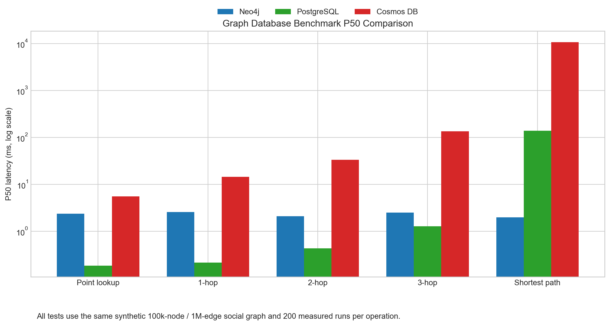

# Neo4j / PostgreSQL / Cosmos DB 图数据库性能对比

## 项目结论

本项目在 Azure 上使用同一份合成社交图数据，对三种图相关存储方案进行了性能对比：

- Neo4j Community Edition，部署在 Azure VM 上
- Azure Database for PostgreSQL Flexible Server
- Azure Cosmos DB Gremlin API

测试结果显示，这三类数据库的适用场景非常不同：

- PostgreSQL 在点查和浅层遍历上最快
- Neo4j 在多跳遍历和最短路径上最强，且延迟更稳定
- Cosmos DB Gremlin 可以完成图存储与查询，但在遍历型负载下明显更慢

如果你的核心工作负载是知识图谱探索、路径推理、证据链追踪，最应该关注的是多跳遍历和最短路径的延迟，而不是单纯的点查结果。

## 配置与测试范围

### Azure 资源配置

| 组件 | 规格 | CPU / 内存 | 其他关键配置 |
|---|---|---:|---|
| Neo4j VM | `Standard_D4s_v5` | 4 vCPU / 16 GiB | Ubuntu 22.04，Premium SSD 数据盘，单机部署 |
| PostgreSQL Flexible Server | `Standard_D4ds_v5` | 4 vCore / 16 GiB | PostgreSQL 16，128 GB 存储，General Purpose，未开启 HA |
| Cosmos DB Gremlin | Gremlin API | 按 RU/s 计费 | 图数据库 `graphdb.social`，分区键 `/pk` |

### 数据规模与测试方式

- 数据规模：100,000 个节点，1,000,000 条边
- 图形状：带有 hub 偏斜的合成社交图
- 执行位置：全部从同一台 Azure VM（`centralus`）发起请求，尽量保证网络口径一致
- 计量方式：每个操作 200 次正式测量，前置 warmup
- 测试操作：点查、1 跳邻居、2 跳计数、3 跳计数、最短路径（最多 5 跳）

### 结果文件

- `results/result_neo4j.json`
- `results/result_postgresql.json`
- `results/result_cosmos_gremlin.json`
- `results/REPORT.md`
- `results/benchmark_p50_comparison.png`

## 性能结果

### P50 延迟（毫秒）

| 操作 | Neo4j Community | PostgreSQL Flexible | Cosmos DB Gremlin |
|---|---:|---:|---:|
| 点查（按 id） | 2.37 | 0.18 | 5.53 |
| 1 跳邻居 | 2.57 | 0.21 | 14.41 |
| 2 跳计数（FoF） | 2.10 | 0.43 | 33.50 |
| 3 跳计数 | 2.51 | 1.28 | 134.93 |
| 最短路径（<=5） | 1.97 | 138.63 | 10631.36 |

### 结果解读

- PostgreSQL 更适合以实体检索、浅层关联查询为主的场景
- Neo4j 更适合图遍历、路径解释和交互式推理
- Cosmos DB Gremlin 的优势更多体现在托管与分布式能力，而不是低延迟遍历

补充说明：这里的“最短路径（<=5）”不是简单地把 5 跳内所有路径都枚举出来，而是寻找两点之间最短的一条可行路径；Neo4j 一旦找到满足条件的更短路径，就可以提前剪枝并停止继续扩展。相比之下，3 跳计数更接近“把 3 层所有可能都展开并统计”，在 hub 偏斜的图上更容易产生大量分支，因此它的延迟可能反而高于最短路径。

### 可视化



## 药物研发场景如何理解

如果把这组测试映射到药物研发，最有价值的查询通常是多跳、可解释的：

- 靶点发现
- 通路追踪
- 药物再定位
- 基因、蛋白、化合物、疾病、文献之间的证据链分析

这类任务真正重要的是：

- 多跳延迟
- 最短路径延迟
- P95 / P99 尾延迟

因此，若你的图数据库主要服务于研发分析和知识推理，Neo4j 的结果最具参考意义；如果主要是结构化检索和浅层关联，PostgreSQL 更经济；如果重点是托管和全球分布式访问，则可以考虑 Cosmos DB Gremlin，但要接受遍历性能和成本的代价。

## 成本对比

### 成本口径

- 价格口径：Azure 公共零售价，`centralus`
- 仅计算持续运行的基础资源费用，不含税费、流量、备份和折扣
- 月成本按约 `730 小时/月` 估算

### 计算单价

| 组件 | 按量单价 | 说明 |
|---|---:|---|
| Neo4j VM `Standard_D4s_v5` | `$0.217 / 小时` | Linux VM 计算费 |
| PostgreSQL `Standard_D4ds_v5` | `$0.402 / 小时` | Flexible Server 计算费 |
| Cosmos DB Gremlin | `$0.008 / 小时 / 100 RU/s` | 按 RU/s 线性计费 |

### 月成本估算

| 组件 | 当前配置 | 估算月成本 |
|---|---|---:|
| Neo4j VM | 4 vCPU / 16 GiB | 约 `$158/月` |
| PostgreSQL Flexible Server | 4 vCore / 16 GiB / 128 GB 存储 | 约 `$294/月`（存储另计，量级较小） |
| Cosmos DB Gremlin（测试时 10,000 RU/s） | 10,000 RU/s | 约 `$584/月` |
| Cosmos DB Gremlin（加载阶段 40,000 RU/s） | 40,000 RU/s | 约 `$2,336/月` |

### 成本结论

- Neo4j 与 PostgreSQL 都属于同一档位的单机/托管数据库成本，差距主要体现在托管开销
- Cosmos DB Gremlin 的费用由 RU/s 决定，吞吐越高，成本增长越快
- 如果长期维持高 RU/s，Cosmos 的成本会显著高于前两者

## 复现方式

主要脚本位于 `benchmark/` 和 `infra/`：

- `benchmark/generate_data.py`：生成测试数据
- `benchmark/bench_neo4j.py`：加载并测试 Neo4j
- `benchmark/bench_postgres.py`：加载并测试 PostgreSQL
- `benchmark/bench_cosmos.py`：加载并测试 Cosmos Gremlin
- `benchmark/make_report.py`：生成 `results/REPORT.md`

基础设施脚本：

- `infra/provision_neo4j_vm.sh`
- `infra/provision_postgres.sh`
- `infra/provision_cosmos.sh`
- `infra/ssh_vm.sh`
- `infra/teardown.sh`

## 清理资源

测试结束后建议删除 Azure 资源，避免持续计费：

```bash
bash infra/teardown.sh
```

